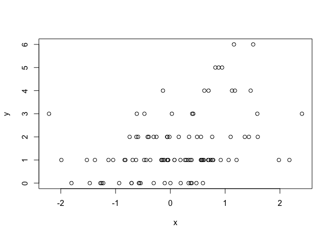

#Data Science Using R
##2 - R Programming

###0) R version used

```r
print(R.version.string)
```

```
## [1] "R version 3.2.3 (2015-12-10)"
```

###1) basic datatypes: input/eval/Robject/vectorlists/matrix/factors

```r
print(1:20)
```

```
##  [1]  1  2  3  4  5  6  7  8  9 10 11 12 13 14 15 16 17 18 19 20
```

```r
print(1+2i)
```

```
## [1] 1+2i
```

```r
print(c(TRUE,"a"))
```

```
## [1] "TRUE" "a"
```

```r
x<-list(1,"a",TRUE,1+4i)
print(x)
```

```
## [[1]]
## [1] 1
## 
## [[2]]
## [1] "a"
## 
## [[3]]
## [1] TRUE
## 
## [[4]]
## [1] 1+4i
```

```r
m<-matrix(nrow=2,ncol=3)
print(m)
```

```
##      [,1] [,2] [,3]
## [1,]   NA   NA   NA
## [2,]   NA   NA   NA
```

```r
dim(m)
```

```
## [1] 2 3
```

```r
print(matrix(1:8,nrow=2,ncol=4))
```

```
##      [,1] [,2] [,3] [,4]
## [1,]    1    3    5    7
## [2,]    2    4    6    8
```

```r
num<-1:10
dim(num)<-c(5,2)
print(num)
```

```
##      [,1] [,2]
## [1,]    1    6
## [2,]    2    7
## [3,]    3    8
## [4,]    4    9
## [5,]    5   10
```

```r
cbind(1:3,10:12)
```

```
##      [,1] [,2]
## [1,]    1   10
## [2,]    2   11
## [3,]    3   12
```

```r
rbind(1:3,10:12)
```

```
##      [,1] [,2] [,3]
## [1,]    1    2    3
## [2,]   10   11   12
```

```r
x<-factor(c("yes","yes","no","yes","no"))
x
```

```
## [1] yes yes no  yes no 
## Levels: no yes
```

```r
table(x)
```

```
## x
##  no yes 
##   2   3
```

```r
unclass(x)
```

```
## [1] 2 2 1 2 1
## attr(,"levels")
## [1] "no"  "yes"
```

```r
y<-factor(c("yes","yes","no","yes","no"), levels=c("yes","no"))
y
```

```
## [1] yes yes no  yes no 
## Levels: yes no
```

```r
x<-c(1,2,NA,3)
is.na(x)
```

```
## [1] FALSE FALSE  TRUE FALSE
```

```r
y<-c(1,2,NaN,NA,6)
is.na(y)
```

```
## [1] FALSE FALSE  TRUE  TRUE FALSE
```

```r
is.nan(y)
```

```
## [1] FALSE FALSE  TRUE FALSE FALSE
```

```r
x<-data.frame(foo=1:4,bar=c(T,T,F,F))
x
```

```
##   foo   bar
## 1   1  TRUE
## 2   2  TRUE
## 3   3 FALSE
## 4   4 FALSE
```

```r
print(paste("nrow:", nrow(x),", ncol:",ncol(x)))
```

```
## [1] "nrow: 4 , ncol: 2"
```

```r
x<-1:3
names(x)
```

```
## NULL
```

```r
names(x)<-c("foo","bar","norf")
names(x)
```

```
## [1] "foo"  "bar"  "norf"
```

```r
x<-list(a=1,b=2,c=3)
x
```

```
## $a
## [1] 1
## 
## $b
## [1] 2
## 
## $c
## [1] 3
```

```r
m<-matrix(1:4,nrow=2,ncol=3)
```

```
## Warning in matrix(1:4, nrow = 2, ncol = 3): data length [4] is not a sub-
## multiple or multiple of the number of columns [3]
```

```r
dimnames(m)<-list(c("a","b"),c("c","d","e"))
m
```

```
##   c d e
## a 1 3 1
## b 2 4 2
```

###2) basic reading: read.table/dput/dget/dump/source/

```r
data<-read.table("foo.txt")
data
```

```
##       V1   V2
## 1   name type
## 2   Meow  Cat
## 3   Woof  Dog
## 4 Kakaka  Fox
```

```r
foo<-read.table(file="test.txt",header=TRUE,sep="\n",nrows=3)
foo
```

```
##                                                                                                                                             X.F48MJBB02HA5PZ_cs_nbp_rc.cs_nbp.32.57.sample.700033450.rbarcode.ACGTTCCAC.primer.V3.V5.subject.159470302.body_site.Saliva.center.WUGSC
## 1                                                                                                                                                                                                                                                         CCTACGGGAGGCAGCAGGGATGAGAT
## 2                                                                                                                                           >F48MJBB02I669X_cs_nbp_rc cs_nbp=32-305 sample=700033450 rbarcode=ACGTTCCAC primer=V3-V5 subject=159470302 body_site=Saliva center=WUGSC
## 3 CCTATCCCCTGTGTGCCTTGAGTATCGGAGGGGCAGGCGGAATTCCTAGTGTAGCGGTGAAATGCGTAGATATTAGGAAGAACACCGGTGGCGAAGGCGGCCTGCTGGACGAAAACTGACGTTGAGGCTCGAAGGCGTGGGGAGCAAGCAGGATTAGATACCCTGGTAGTCCACGCGGTAAACGATGAATACTAGGCGTTGGTGCCCCAAGGGCATCGGTGCCGTCGCAAACGCAATAAGTATTCCACCTGGGGAGTACGTTCGCAAGAATGAA
```

```r
# passing adata around by deparsing R object using dput
# and reading back using dget
y<-data.frame(a=1,b="a")
#dput(y)
dput(y,file="y.R") # actually creates physical y.R
new.y<-dget("y.R")
new.y
```

```
##   a b
## 1 1 a
```

```r
x<-"foo"
y<-data.frame(a=1, b="a")
dump(c("x","y"),file="data.R") # creates physical data.R
rm(x,y)
source("data.R")
y
```

```
##   a b
## 1 1 a
```

```r
x
```

```
## [1] "foo"
```

###3) basic connections: file/readLines/writeLines/url

```r
con<-file("HMP_16s_single_cell_MDA_from_fecal_specimens-short.txt","r")
x<-readLines(con,100)
x
```

```
## [1] ">1042139-140-141-142_A04_TIGR_WGACA01T1F15058_1042140_1122243671925_016_1122232824624 Trace of J:\\Environmental_Genomics\\Lasken lab\\Lasken Lab DNA Sequencing Log\\03-29-10 Sequencing Results - Fecal Combo sort\\TraceFiles-20100329131835\\1042139-140-141-142_A04_TIGR_WGACA01T1F15058_1042140_1122243671925_016_1122232824624.scf; length: 485; low quality 95; medium quality 145; high quality 245"
## [2] "ACTGCTAATACCGCATATGCCATGAACATCGCATGATGAAAATGGGAAAGGAGCAATCCG"                                                                                                                                                                                                                                                                                                                                                
## [3] "CTAATAGATGAGCTTGCGTCTGATTAACTAGTTGGTGTGGTAATGGCATACCAAGGTAAC"                                                                                                                                                                                                                                                                                                                                                
## [4] "GATCAGTAGCCGGACTGAGAGGTTGAACGGCCACATTGGGACTGAGATACGGCCCAGACT"                                                                                                                                                                                                                                                                                                                                                
## [5] "CCTACGGGAGGCAGCAGTCGGGAATATTGCGCAATGGAGGAAACTCTGACGCAGTGACGC"                                                                                                                                                                                                                                                                                                                                                
## [6] "CGCGTATAGGATGAAGGTTTTCGGATTGTAAACTATTGTCATTAGGGAAGATAAAAGACA"                                                                                                                                                                                                                                                                                                                                                
## [7] "GTACCTAAGGAGGAAGC"
```

```r
out<-file("test-output.txt","w")
writeLines(text = x,con = out)
close(con)
close(out)
con<-url("http://www.google.com","r")
x<-readLines(con)
```

```
## Warning in readLines(con): incomplete final line found on 'http://
## www.google.com'
```

```r
head(x,1)
```

```
## [1] "<!doctype html><html itemscope=\"\" itemtype=\"http://schema.org/WebPage\" lang=\"en\"><head><meta content=\"Search the world's information, including webpages, images, videos and more. Google has many special features to help you find exactly what you're looking for.\" name=\"description\"><meta content=\"noodp\" name=\"robots\"><meta content=\"text/html; charset=UTF-8\" http-equiv=\"Content-Type\"><meta content=\"/logos/doodles/2016/lunar-new-year-2016-5134827118395392-hp.jpg\" itemprop=\"image\"><meta content=\"Happy Lunar New Year! #GoogleDoodle\" property=\"og:description\"><meta content=\"http://www.google.com/logos/doodles/2016/lunar-new-year-2016-5134827118395392-thp.png\" property=\"og:image\"><meta content=\"500\" property=\"og:image:width\"><meta content=\"200\" property=\"og:image:height\"><title>Google</title><script>(function(){window.google={kEI:'-V-5Vr3lGISMjwOEkrW4CQ',kEXPI:'1350255,3700062,3700307,3700385,4028790,4029815,4031109,4032677,4033307,4036509,4036527,4038012,4039268,4039954,4042784,4042792,4043492,4044606,4045841,4046304,4048882,4049499,4049501,4049549,4049557,4050886,4050891,4050908,4051241,4051559,4051596,4051714,4052304,4052781,4054117,4054224,4054284,4054513,4055744,4056038,4056162,4056590,4056606,4057170,4057586,4057836,4057920,4058004,4058033,4058117,4058337,4058544,4059275,4059318,4059328,4059359,8300096,8300273,8300310,8300317,8502095,8502315,8502347,8502691,8502985,8503109,8503131,8503212,8503331,8503332,10200083',authuser:0,kscs:'c9c918f0_24'};google.kHL='en';})();(function(){google.lc=[];google.li=0;google.getEI=function(a){for(var b;a&&(!a.getAttribute||!(b=a.getAttribute(\"eid\")));)a=a.parentNode;return b||google.kEI};google.getLEI=function(a){for(var b=null;a&&(!a.getAttribute||!(b=a.getAttribute(\"leid\")));)a=a.parentNode;return b};google.https=function(){return\"https:\"==window.location.protocol};google.ml=function(){return null};google.wl=function(a,b){try{google.ml(Error(a),!1,b)}catch(d){}};google.time=function(){return(new Date).getTime()};google.log=function(a,b,d,e,g){a=google.logUrl(a,b,d,e,g);if(\"\"!=a){b=new Image;var c=google.lc,f=google.li;c[f]=b;b.onerror=b.onload=b.onabort=function(){delete c[f]};window.google&&window.google.vel&&window.google.vel.lu&&window.google.vel.lu(a);b.src=a;google.li=f+1}};google.logUrl=function(a,b,d,e,g){var c=\"\",f=google.ls||\"\";if(!d&&-1==b.search(\"&ei=\")){var h=google.getEI(e),c=\"&ei=\"+h;-1==b.search(\"&lei=\")&&((e=google.getLEI(e))?c+=\"&lei=\"+e:h!=google.kEI&&(c+=\"&lei=\"+google.kEI))}a=d||\"/\"+(g||\"gen_204\")+\"?atyp=i&ct=\"+a+\"&cad=\"+b+c+f+\"&zx=\"+google.time();/^http:/i.test(a)&&google.https()&&(google.ml(Error(\"a\"),!1,{src:a,glmm:1}),a=\"\");return a};google.y={};google.x=function(a,b){google.y[a.id]=[a,b];return!1};google.load=function(a,b,d){google.x({id:a+k++},function(){google.load(a,b,d)})};var k=0;})();var _gjwl=location;function _gjuc(){var a=_gjwl.href.indexOf(\"#\");if(0<=a&&(a=_gjwl.href.substring(a),0<a.indexOf(\"&q=\")||0<=a.indexOf(\"#q=\"))&&(a=a.substring(1),-1==a.indexOf(\"#\"))){for(var d=0;d<a.length;){var b=d;\"&\"==a.charAt(b)&&++b;var c=a.indexOf(\"&\",b);-1==c&&(c=a.length);b=a.substring(b,c);if(0==b.indexOf(\"fp=\"))a=a.substring(0,d)+a.substring(c,a.length),c=d;else if(\"cad=h\"==b)return 0;d=c}_gjwl.href=\"/search?\"+a+\"&cad=h\";return 1}return 0}"
```

```r
close(con)
```

###4) basic subsetting: vector/list/matrix/partial-matching/removing-NA-values

```r
library(datasets)
x<-c("a","b","c","d","e")
x[1:4]
```

```
## [1] "a" "b" "c" "d"
```

```r
x[x>"b"]
```

```
## [1] "c" "d" "e"
```

```r
y<-list(foo=1:4,bar=c(0.6,0.4,0.2),baz=TRUE,bad=list(4,3,2,1))
y[[2]]
```

```
## [1] 0.6 0.4 0.2
```

```r
y$bar
```

```
## [1] 0.6 0.4 0.2
```

```r
y[["bar"]]
```

```
## [1] 0.6 0.4 0.2
```

```r
y[["bad"]][[3]]
```

```
## [1] 2
```

```r
m<-matrix(1:6,2,3)
m
```

```
##      [,1] [,2] [,3]
## [1,]    1    3    5
## [2,]    2    4    6
```

```r
m[1,2] #m[row,col]
```

```
## [1] 3
```

```r
m[1,] #m entire row=1
```

```
## [1] 1 3 5
```

```r
m[1,,drop=FALSE] # if drop=FALSE, the 1x1 matrix is maintained
```

```
##      [,1] [,2] [,3]
## [1,]    1    3    5
```

```r
x<-list(aardvark=1:5)
x[["aard",exact=FALSE]] # if exact=FALSE, partial matching is ok
```

```
## [1] 1 2 3 4 5
```

```r
x<-c(1,2,NA,4,NA,5)
x[!is.na(x)]
```

```
## [1] 1 2 4 5
```

```r
y<-c("a","b",NA,"d",NA,NA)
x[complete.cases(x,y)]
```

```
## [1] 1 2 4
```

```r
y[complete.cases(x,y)]
```

```
## [1] "a" "b" "d"
```

```r
airquality[1:10,]
```

```
##    Ozone Solar.R Wind Temp Month Day
## 1     41     190  7.4   67     5   1
## 2     36     118  8.0   72     5   2
## 3     12     149 12.6   74     5   3
## 4     18     313 11.5   62     5   4
## 5     NA      NA 14.3   56     5   5
## 6     28      NA 14.9   66     5   6
## 7     23     299  8.6   65     5   7
## 8     19      99 13.8   59     5   8
## 9      8      19 20.1   61     5   9
## 10    NA     194  8.6   69     5  10
```

```r
airquality[complete.cases(airquality),][1:10,]
```

```
##    Ozone Solar.R Wind Temp Month Day
## 1     41     190  7.4   67     5   1
## 2     36     118  8.0   72     5   2
## 3     12     149 12.6   74     5   3
## 4     18     313 11.5   62     5   4
## 7     23     299  8.6   65     5   7
## 8     19      99 13.8   59     5   8
## 9      8      19 20.1   61     5   9
## 12    16     256  9.7   69     5  12
## 13    11     290  9.2   66     5  13
## 14    14     274 10.9   68     5  14
```

###5) basic vectorized operations

```r
x<-1:4;y<-6:9
x*y
```

```
## [1]  6 14 24 36
```

```r
x<-matrix(1:4,2,2);y<-matrix(rep(10,4),2,2)
x*y # element-wise multiplication
```

```
##      [,1] [,2]
## [1,]   10   30
## [2,]   20   40
```

```r
x%*%y # true matrix multiplication
```

```
##      [,1] [,2]
## [1,]   40   40
## [2,]   60   60
```

```r
y%*%x
```

```
##      [,1] [,2]
## [1,]   30   70
## [2,]   30   70
```

###6) basic control structures: if-else/for/while/repeat

```r
x<-5;y<-7
if(x>y) {
    print("x is bigger than y")
} else if(x<y) {
    print("y is bigger than x")
} else {
    print("x and y are same")
}
```

```
## [1] "y is bigger than x"
```

```r
z<- if(x>3) {
    10
} else {
    30
}
z
```

```
## [1] 10
```

```r
for(i in 4:1) {
    print(i)
}
```

```
## [1] 4
## [1] 3
## [1] 2
## [1] 1
```

```r
x<-c("d","c","b","a")
for(i in 1:4){ print(x[i]) } # 1 of 3 ways to achieve similar result
```

```
## [1] "d"
## [1] "c"
## [1] "b"
## [1] "a"
```

```r
for(i in seq_along(x)){ print(x[i]) } # 1 of 3 ways to achieve similar result
```

```
## [1] "d"
## [1] "c"
## [1] "b"
## [1] "a"
```

```r
for(letter in x) { print(letter) } # 1 of 3 ways to achieve similar result
```

```
## [1] "d"
## [1] "c"
## [1] "b"
## [1] "a"
```

```r
x<-matrix(1:6,2,3)
x
```

```
##      [,1] [,2] [,3]
## [1,]    1    3    5
## [2,]    2    4    6
```

```r
# nested for-loop
for(i in seq_len(nrow(x))) {
    for(j in seq_len(ncol(x))) {
        print(x[i,j])
    }
}
```

```
## [1] 1
## [1] 3
## [1] 5
## [1] 2
## [1] 4
## [1] 6
```

```r
count<-0
while(count<10) {
    print(count)
    count<-count+1
}
```

```
## [1] 0
## [1] 1
## [1] 2
## [1] 3
## [1] 4
## [1] 5
## [1] 6
## [1] 7
## [1] 8
## [1] 9
```

```r
z<-5
while(z>=3 && z<=10) {
    print(z)
    coin<-rbinom(1,1,0.5)
    if(coin==1) { # random coin toss-up
        z<-z+1
    } else {
        z<-z-1
    }
}
```

```
## [1] 5
## [1] 6
## [1] 5
## [1] 4
## [1] 3
```

```r
x0<-1
i<-0
repeat{ #infinite while(TRUE) loop
    i<-i+1
    x1<-rnorm(1)
    if(abs(x1-x0)>6) {
        print(abs(x1-x0))
        print(i)
        break
    } else {
        x0<-x1
    }
}
```

```
## [1] 6.126088
## [1] 16405
```

```r
for(i in 1:100) {
    if(i<=90) { # skip from 1 to 90
        next
    }
    print(i)
}
```

```
## [1] 91
## [1] 92
## [1] 93
## [1] 94
## [1] 95
## [1] 96
## [1] 97
## [1] 98
## [1] 99
## [1] 100
```

###7) basic functions: function/...arg/args

```r
library(datasets)
above<-function(x,n) {
    use<-x>n
    x[use]
}
above(1:20,12)
```

```
## [1] 13 14 15 16 17 18 19 20
```

```r
colmeans<-function(y) {
    nc<-ncol(y)
    means<-numeric(nc)
    for(i in 1:nc){
        #means[i]<-mean(y[,i])
        means[i]<-mean(y[,i][!is.na(y[,i])])
    }
    means
}
colmeans(airquality)
```

```
## [1]  42.129310 185.931507   9.957516  77.882353   6.993464  15.803922
```

```r
myplot<-function(x,y,type="l",...){
    plot(x,y,type=type,...) # other arguments after x,y,type as ...
}
myplot(1,1,main="test")
```

\

```r
args(paste)
```

```
## function (..., sep = " ", collapse = NULL) 
## NULL
```

```r
paste("a","b",sep=":") # after ..., has to be explicitly named
```

```
## [1] "a:b"
```

```r
paste("a","b",se=":") # partial match invalid
```

```
## [1] "a b :"
```

###8) basic scoping rules: symbol-binding/scoping-rules

```r
lm<-function(x) { x * x }
lm # ^ above function is called, not the lm function in stats package
```

```
## function(x) { x * x }
```

```r
# R uses lexical scoping / static scoping
# NOT dynamic scoping
f<-function(x,y) { x^2 + y/z }
z<-2;f(10,100)
```

```
## [1] 150
```

```r
f<-function(x,y) { z<-4; x^2 + y/z }
z<-2;f(10,100)
```

```
## [1] 125
```

```r
make.power<-function(n){
    pow<-function(x){
        x^n
    }
    pow
}
# function returns another function
cube<-make.power(3)
cube(3)
```

```
## [1] 27
```

```r
square<-make.power(2)
cube(2)
```

```
## [1] 8
```

```r
y<-10
f<-function(x){y<-2;y^2+g(x)}
g<-function(x){x*y}
f(3) # 4 + g(3) ==> 4 + (3*10) = 34; different scope of y
```

```
## [1] 34
```

###9) basic dates and times

```r
unclass(as.Date("2016-02-09")) # days since 1970-01-01
```

```
## [1] 16840
```

```r
# time is either POSIXct (large integer) or POSIXlt (list + other info)
x<-Sys.time()
p<-as.POSIXlt(x)
paste(p$hour,p$min,p$sec)
```

```
## [1] "13 50 19.8309190273285"
```

```r
unclass(Sys.time()) # time since 1970-01-01
```

```
## [1] 1455054620
```

```r
datestring<-c("January 10, 2012 10:40", "December 9, 2011 9:10")
strptime(datestring, "%B %d, %Y %H:%M")
```

```
## [1] "2012-01-10 10:40:00 PST" "2011-12-09 09:10:00 PST"
```

```r
as.Date("2012-03-01")-as.Date("2012-02-08")
```

```
## Time difference of 22 days
```

```r
as.POSIXct("2015-02-09 13:47:00", tz="PST8PDT")-as.POSIXct("2015-02-09 13:47:00", tz="EST5EDT")
```

```
## Time difference of 3 hours
```

###10) basic loop functions: lapply/sapply/apply/mapply/tapply/split

```r
# lapply: loop over list & eval a function on each element
# input: list/vector
# output: list
x<-list(a=1:5,b=rnorm(10))
lapply(x,mean)
```

```
## $a
## [1] 3
## 
## $b
## [1] 0.455752
```

```r
lapply(1:4,runif,min=0,max=10) # min max arg is for runif func (random uniform variables)
```

```
## [[1]]
## [1] 0.07323911
## 
## [[2]]
## [1] 9.362562 1.733975
## 
## [[3]]
## [1] 4.2986330 8.2594681 0.5104832
## 
## [[4]]
## [1] 1.460893 3.185801 7.696158 2.865528
```

```r
# sapply: simplified result of lapply
sapply(list(a=1.5,b=rnorm(10),c=rnorm(20,1),d=rnorm(100,5)),mean)
```

```
##         a         b         c         d 
## 1.5000000 0.5472564 1.1368592 5.0116387
```

```r
# apply: eval a function over margins of an array
# not much faster than a loop (but simiplified in one line)
# input: array or matrix
# output: vector or matrix
m<-matrix(rnorm(200),2,5)
m
```

```
##            [,1]      [,2]       [,3]       [,4]      [,5]
## [1,] -0.2177473 -1.486094  1.6762104 -0.4226372 -0.125691
## [2,]  0.6451933  1.087380 -0.3133798 -2.6875830  0.990028
```

```r
# apply sum for each row (1)
apply(m,1,sum) # ~ rowSums(m); 1 indicates row, 2 indicates column
```

```
## [1] -0.5759590 -0.2783613
```

```r
# average matrix values in an array
a<-array(rnorm(2*2*10),c(2,2,10))
apply(a,c(1,2),mean) # ~ rowMeans(a,dims=2)
```

```
##             [,1]       [,2]
## [1,] -0.00302805 -0.3377071
## [2,]  0.27358340 -0.5081933
```

```r
# mapply: multivariate apply of sorts -- function eval in parallel
# input: functions
# output: list/vector
mapply(rep,1:4,4:1) # ~ list(rep(1,4),rep(2,3),rep(3,2),rep(4,1))
```

```
## [[1]]
## [1] 1 1 1 1
## 
## [[2]]
## [1] 2 2 2
## 
## [[3]]
## [1] 3 3
## 
## [[4]]
## [1] 4
```

```r
# vectorizing a function
noise<-function(n,mean,sd,sed){set.seed(sed);rnorm(n,mean,sd)}
# list of vectors of noise(1,1,2,37), noise(2,2,2,37), et cetera
mapply(noise,1:5,1:5,2,37)
```

```
## [[1]]
## [1] 1.249508
## 
## [[2]]
## [1] 2.249508 2.764149
## 
## [[3]]
## [1] 3.249508 3.764149 4.158486
## 
## [[4]]
## [1] 4.249508 4.764149 5.158486 3.412504
## 
## [[5]]
## [1] 5.249508 5.764149 6.158486 4.412504 3.343302
```

```r
# tapply: apply function over subsets of vector
# input:
# output:
x<-c(rnorm(2),runif(2),rnorm(2,1))
x;f<-gl(3,2)
```

```
## [1] -0.3327136 -0.1921595  0.9135560  0.8002168  1.8559544  1.2159955
```

```r
tapply(x,c(1,1,2,2,3,3),sum) # apply Factor and add sum according to such Factor
```

```
##          1          2          3 
## -0.5248731  1.7137728  3.0719499
```

```r
tapply(x,f,sum,simply=FALSE) # disables simplificationn
```

```
##          1          2          3 
## -0.5248731  1.7137728  3.0719499
```

```r
tapply(x,f,range)
```

```
## $`1`
## [1] -0.3327136 -0.1921595
## 
## $`2`
## [1] 0.8002168 0.9135560
## 
## $`3`
## [1] 1.215995 1.855954
```

```r
# splits per Factor (f) as subvector of x
split(x,f)
```

```
## $`1`
## [1] -0.3327136 -0.1921595
## 
## $`2`
## [1] 0.9135560 0.8002168
## 
## $`3`
## [1] 1.855954 1.215995
```

```r
lapply(split(x,f),sum) # can take the split subvector and apply sum
```

```
## $`1`
## [1] -0.5248731
## 
## $`2`
## [1] 1.713773
## 
## $`3`
## [1] 3.07195
```

```r
# splitting a data frame
library(datasets)
s<-split(airquality,airquality$Month) # split based on the Month (as Factor)
lapply(s,function(x){
    colMeans(x[,c("Ozone","Solar.R","Wind")],na.rm=TRUE)})
```

```
## $`5`
##     Ozone   Solar.R      Wind 
##  23.61538 181.29630  11.62258 
## 
## $`6`
##     Ozone   Solar.R      Wind 
##  29.44444 190.16667  10.26667 
## 
## $`7`
##      Ozone    Solar.R       Wind 
##  59.115385 216.483871   8.941935 
## 
## $`8`
##      Ozone    Solar.R       Wind 
##  59.961538 171.857143   8.793548 
## 
## $`9`
##     Ozone   Solar.R      Wind 
##  31.44828 167.43333  10.18000
```

```r
sapply(s,function(x){
    colMeans(x[,c("Ozone","Solar.R","Wind")],na.rm=TRUE)})
```

```
##                 5         6          7          8         9
## Ozone    23.61538  29.44444  59.115385  59.961538  31.44828
## Solar.R 181.29630 190.16667 216.483871 171.857143 167.43333
## Wind     11.62258  10.26667   8.941935   8.793548  10.18000
```

```r
# splitting on more than one level
interaction(1:5,5:1)
```

```
## [1] 1.5 2.4 3.3 4.2 5.1
## 25 Levels: 1.1 2.1 3.1 4.1 5.1 1.2 2.2 3.2 4.2 5.2 1.3 2.3 3.3 4.3 ... 5.5
```

```r
split(rnorm(4),list(1:2,2:1))
```

```
## $`1.1`
## numeric(0)
## 
## $`2.1`
## [1] 0.03869354 0.98230990
## 
## $`1.2`
## [1] -0.3777021  1.4248151
## 
## $`2.2`
## numeric(0)
```

```r
split(rnorm(4),list(1:2,2:1),drop=TRUE)
```

```
## $`2.1`
## [1] -1.667528 -1.736924
## 
## $`1.2`
## [1]  0.3104645 -2.7048497
```

###11) str function

```r
x<-rnorm(100,2,4)
summary(x)
```

```
##    Min. 1st Qu.  Median    Mean 3rd Qu.    Max. 
## -7.5380 -0.6855  2.2440  2.0840  5.1780 12.9900
```

```r
str(x)
```

```
##  num [1:100] 3.612 -0.928 0.887 7.137 5.296 ...
```

```r
f<-gl(10,10)
f
```

```
##   [1] 1  1  1  1  1  1  1  1  1  1  2  2  2  2  2  2  2  2  2  2  3  3  3 
##  [24] 3  3  3  3  3  3  3  4  4  4  4  4  4  4  4  4  4  5  5  5  5  5  5 
##  [47] 5  5  5  5  6  6  6  6  6  6  6  6  6  6  7  7  7  7  7  7  7  7  7 
##  [70] 7  8  8  8  8  8  8  8  8  8  8  9  9  9  9  9  9  9  9  9  9  10 10
##  [93] 10 10 10 10 10 10 10 10
## Levels: 1 2 3 4 5 6 7 8 9 10
```

```r
summary(f)
```

```
##  1  2  3  4  5  6  7  8  9 10 
## 10 10 10 10 10 10 10 10 10 10
```

```r
str(f)
```

```
##  Factor w/ 10 levels "1","2","3","4",..: 1 1 1 1 1 1 1 1 1 1 ...
```

```r
library(datasets)
str(airquality)
```

```
## 'data.frame':	153 obs. of  6 variables:
##  $ Ozone  : int  41 36 12 18 NA 28 23 19 8 NA ...
##  $ Solar.R: int  190 118 149 313 NA NA 299 99 19 194 ...
##  $ Wind   : num  7.4 8 12.6 11.5 14.3 14.9 8.6 13.8 20.1 8.6 ...
##  $ Temp   : int  67 72 74 62 56 66 65 59 61 69 ...
##  $ Month  : int  5 5 5 5 5 5 5 5 5 5 ...
##  $ Day    : int  1 2 3 4 5 6 7 8 9 10 ...
```

```r
m<-matrix(rnorm(100),10,10)
str(m)
```

```
##  num [1:10, 1:10] 0.0338 -0.6795 0.7305 0.3369 -0.5377 ...
```

```r
str(split(airquality,airquality$Month))
```

```
## List of 5
##  $ 5:'data.frame':	31 obs. of  6 variables:
##   ..$ Ozone  : int [1:31] 41 36 12 18 NA 28 23 19 8 NA ...
##   ..$ Solar.R: int [1:31] 190 118 149 313 NA NA 299 99 19 194 ...
##   ..$ Wind   : num [1:31] 7.4 8 12.6 11.5 14.3 14.9 8.6 13.8 20.1 8.6 ...
##   ..$ Temp   : int [1:31] 67 72 74 62 56 66 65 59 61 69 ...
##   ..$ Month  : int [1:31] 5 5 5 5 5 5 5 5 5 5 ...
##   ..$ Day    : int [1:31] 1 2 3 4 5 6 7 8 9 10 ...
##  $ 6:'data.frame':	30 obs. of  6 variables:
##   ..$ Ozone  : int [1:30] NA NA NA NA NA NA 29 NA 71 39 ...
##   ..$ Solar.R: int [1:30] 286 287 242 186 220 264 127 273 291 323 ...
##   ..$ Wind   : num [1:30] 8.6 9.7 16.1 9.2 8.6 14.3 9.7 6.9 13.8 11.5 ...
##   ..$ Temp   : int [1:30] 78 74 67 84 85 79 82 87 90 87 ...
##   ..$ Month  : int [1:30] 6 6 6 6 6 6 6 6 6 6 ...
##   ..$ Day    : int [1:30] 1 2 3 4 5 6 7 8 9 10 ...
##  $ 7:'data.frame':	31 obs. of  6 variables:
##   ..$ Ozone  : int [1:31] 135 49 32 NA 64 40 77 97 97 85 ...
##   ..$ Solar.R: int [1:31] 269 248 236 101 175 314 276 267 272 175 ...
##   ..$ Wind   : num [1:31] 4.1 9.2 9.2 10.9 4.6 10.9 5.1 6.3 5.7 7.4 ...
##   ..$ Temp   : int [1:31] 84 85 81 84 83 83 88 92 92 89 ...
##   ..$ Month  : int [1:31] 7 7 7 7 7 7 7 7 7 7 ...
##   ..$ Day    : int [1:31] 1 2 3 4 5 6 7 8 9 10 ...
##  $ 8:'data.frame':	31 obs. of  6 variables:
##   ..$ Ozone  : int [1:31] 39 9 16 78 35 66 122 89 110 NA ...
##   ..$ Solar.R: int [1:31] 83 24 77 NA NA NA 255 229 207 222 ...
##   ..$ Wind   : num [1:31] 6.9 13.8 7.4 6.9 7.4 4.6 4 10.3 8 8.6 ...
##   ..$ Temp   : int [1:31] 81 81 82 86 85 87 89 90 90 92 ...
##   ..$ Month  : int [1:31] 8 8 8 8 8 8 8 8 8 8 ...
##   ..$ Day    : int [1:31] 1 2 3 4 5 6 7 8 9 10 ...
##  $ 9:'data.frame':	30 obs. of  6 variables:
##   ..$ Ozone  : int [1:30] 96 78 73 91 47 32 20 23 21 24 ...
##   ..$ Solar.R: int [1:30] 167 197 183 189 95 92 252 220 230 259 ...
##   ..$ Wind   : num [1:30] 6.9 5.1 2.8 4.6 7.4 15.5 10.9 10.3 10.9 9.7 ...
##   ..$ Temp   : int [1:30] 91 92 93 93 87 84 80 78 75 73 ...
##   ..$ Month  : int [1:30] 9 9 9 9 9 9 9 9 9 9 ...
##   ..$ Day    : int [1:30] 1 2 3 4 5 6 7 8 9 10 ...
```

###12) basic simulation: random-num-gen/sim-linear-model/random-sampling

```r
# rnorm: random normal variates with mean/std
rnorm(10,10,1)
```

```
##  [1]  8.460311 10.050853  9.573142  9.585883  9.569508 12.031154  9.760372
##  [8] 11.484171 10.921959  9.966791
```

```r
# dnorm: probability density with mean/std at point/vector of points
dnorm(10,10,1)
```

```
## [1] 0.3989423
```

```r
# pnorm: eval cumulative distribution function for normal distribution
pnorm(10,10,1)
```

```
## [1] 0.5
```

```r
# rpois: gen random Poisson variates with given rate
rpois(10,10)
```

```
##  [1] 14 11  8  6  6  6  8 16 13 15
```

```r
x<-rnorm(10)
summary(x)
```

```
##    Min. 1st Qu.  Median    Mean 3rd Qu.    Max. 
## -1.6990 -1.2360 -0.6682 -0.4222  0.2503  1.6650
```

```r
set.seed(1)
rpois(10,1)
```

```
##  [1] 0 1 1 2 0 2 3 1 1 0
```

```r
# cumulative distribution
ppois(2,2) ## Pr(x<=2)
```

```
## [1] 0.6766764
```

```r
ppois(4,2) ## Pr(x<=4)
```

```
## [1] 0.947347
```

```r
ppois(6,2) ## Pr(x<=6)
```

```
## [1] 0.9954662
```

```r
# linear model:
# y = ß0 + ß1x + ε 
# where ε ~ N(0.2^2)
# assume x ~ N(0.1^2), ß0 = 0.5, ß1=2
set.seed(20)
x<-rnorm(100)
e<-rnorm(100,0,2)
y<-0.5+2*x+e
summary(y)
```

```
##    Min. 1st Qu.  Median    Mean 3rd Qu.    Max. 
## -6.4080 -1.5400  0.6789  0.6893  2.9300  6.5050
```

```r
plot(x,y)
```

\

```r
# if x is binary
set.seed(10)
x<-rbinom(100,1,0.5)
e<-rnorm(100,0,2)
y<-0.5+2*x+e
summary(y)
```

```
##    Min. 1st Qu.  Median    Mean 3rd Qu.    Max. 
## -3.4940 -0.1409  1.5770  1.4320  2.8400  6.9410
```

```r
plot(x,y)
```

\

```r
# simulation of Poisson model
# Y ~ Poisson(µ)
# log µ = ß0 + ß1x
# and ß0 = 0.5 and ß1 = 0.3
set.seed(1)
x<-rnorm(100)
log.mu<-0.5+0.3*x
y<-rpois(100,exp(log.mu))
summary(y)
```

```
##    Min. 1st Qu.  Median    Mean 3rd Qu.    Max. 
##    0.00    1.00    1.00    1.55    2.00    6.00
```

```r
plot(x,y)
```

\

```r
# random sampling
set.seed(1)
sample(1:100,4) # randomly sampling 4 in vector of 1:100
```

```
## [1] 27 37 57 89
```

```r
sample(letters,5)
```

```
## [1] "f" "w" "y" "p" "n"
```

```r
sample(letters,20,replace=TRUE)
```

```
##  [1] "b" "f" "e" "r" "j" "u" "m" "s" "z" "j" "u" "y" "f" "q" "d" "g" "k"
## [18] "a" "j" "w"
```

```r
sample(1:10) # permutation
```

```
##  [1]  4  5  9 10  2  8  3  7  1  6
```

```r
sample(1:10,replace=TRUE) # with replacement
```

```
##  [1] 5 9 7 8 6 6 8 1 5 8
```
